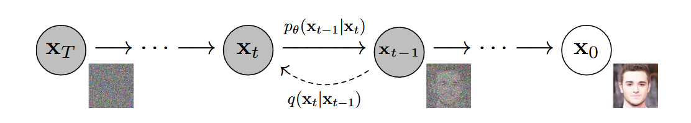
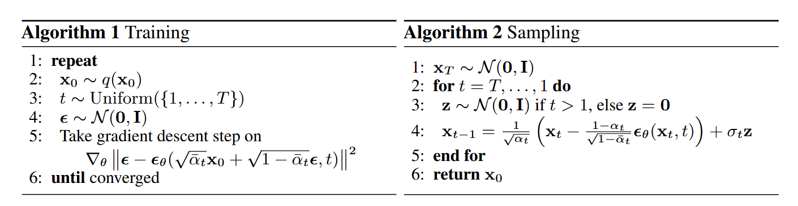

## 扩散模型-以DDPM为例

**前言**：

学习扩散模型很容易陷入数学公式，代码实现，原理说明的混淆之中。原因是数学公式一般形式上很复杂，无法将代码和原理和数学对应起来，这篇文章的目的，主要通过逻辑的梳理，结合原理-数学-代码路线，希望能够将我学习扩散模型的经验分享出来。

扩散模型目前结合的方向很多，除了图像生成以外，在生物学，尤其是蛋白质生成当中也发挥了重要的作用。（alphafold3，David Baker的 RFDiffusion等）。扩散模型也可以和强化学习结合解决基于序列的决策问题。（强化学习的blog也在撰写中）。

这篇blog主要还是聚焦于扩散模型经典的实现：DDPM（参考资料4）。关于一些发展的模型像DDIM（称为方法更合适，加快采样速率），在掌握这个模型后应是比较简单的。

当然了，扩散模型的学习只靠这篇文章是不够的，以下列出的一些参考资料都是非常高质量的知识分享，比较推荐的学习路线是：

2->5->4->3->1。需要注意的是，参考资料4非常值得阅读，系统讨论了数学公式。参考资料1可能需要一些基础之后才能看懂。其次，生成模型的老祖VAE和GAN也是需要去了解的：AE-VAE-GAN，尤其是关于最大似然估计到推导变分下界的数学变换，还是很有启发。

本文章个人总结撰写，难免会有不对的地方，还请批评指正，另外，关于Diffusion model在生物模型上的应用，后面也会原理+代码进行推送。

希望能够让读者有所收获。


Reference (顺序不分先后): 

1. Lilianweng blog: https://lilianweng.github.io/posts/2021-07-11-diffusion-models/

2. Hung-yi Lee videos: [【生成式AI】Diffusion Model 原理剖析 (1/4) (optional) (youtube.com)](https://www.youtube.com/watch?v=ifCDXFdeaaM&list=PLJV_el3uVTsNi7PgekEUFsyVllAJXRsP-&index=6)

3. Understanding Diffusion Models: A Unified Perspective [https://arxiv.org/abs/2208.11970]

4. denoising diffusion probabilistic models (DDPM; Ho et al. 2020)[https://arxiv.org/abs/2006.11239]

5. B站参考：[一个视频看懂扩散模型DDPM原理推导](https://www.bilibili.com/video/BV1p24y1K7Pf?spm_id_from=333.788.videopod.sections&vd_source=7475af279c35642dd00ebe3c305bd3db)

   

### 0. 问题定义：扩散模型究竟在解决一件什么样的事情？

扩散模型属于生成模型的一种，其本质其实就是在做生成，即：对于一个来源于特定分布$p(x)$中观察到的样本$x$，我们想要通过一个生成式的模型来得到这个特定的真实的分布$p(x)$。

```
Given observed samples x from a distribution of interest, the goal of a generative model is to learn to model its true data distribution p(x). Once learned, we can generate new samples from our approximate model at will. Furthermore, under some formulations, we are able to use the learned model to evaluate the likelihood of observed or sampled data as well. ----Understanding Diffusion Models: A Unified Perspective 
```

举例子来说，就是我的目标是生成一张狗的图片，而狗这个样本实际上来源于其背后的一个分布，我们需要估计出这个分布，这样我就能从无到有生成我想要的狗的图片。



而上图是扩散模型的概图，其想法是：

首先通过加噪过程，也就是上图的从右到左，在原始图像$X_0$中逐步加入采样于高斯分布的噪声，在时间步$t$后最终得到$X_T$，是一个纯粹的高斯噪声，用数学语言描述就是：

加噪过程： $ q(x_t | x_{t-1}) $ ;时间步T后： $ x_T \in \mathcal{N}(0,1) $ 

这里会有一个问题：为什么最终的图像**会是高斯分布**？为什么**需要是高斯分布**？

第一个问题的回答：因为在每一步时间$t$我们都会加一个高斯噪声，在足够的时间步之后，最终图像也会趋向于高斯的噪声。

第二个问题的回答：因为我们希望生成的过程比较可控，如果我在加噪的过程中，让原始图像最终变成高斯噪声，那么去噪的时候，我就可以从一个高斯分布出发，来生成图像。

所以上图中的从左到右即是去噪过程，从采样于高斯噪声的一个随机噪声$x_T$，通过逐步减去时间步之间的噪声（这个做法是DDPM的实现），最终可以得到原始图像$X_0$。用数学语言描述就是：

去噪过程： $ p_{\theta}(x_{t-1} |  x_t) $ ; 时间步T后： $x_0$ 

综上：扩散模型分为**加噪过程（foward process）和去噪过程（reverse process）**，在加噪过程，向原始图像中逐步加入人为的高斯噪声。在去噪过程当中，从高斯噪声出发逐步减去高斯噪声，最终生成图像。需要明确的是，神经网络在去噪过程当中需要根据当前的图像和时间步预测出此图像的噪声，然后再减去噪声。

更深一点的理解：在去噪过程当中 $ p_{\theta} $ 即是我们的模型，我们的模型需要“吃”一个 $ x $ 和 $ t $ ，得到 $ t-1 $ ，这里的 $ p_{\theta}(x_{t-1}| x_t) $ 是$ t-1 $ 时刻 $ x $ 所对对应的分布而不是单纯的一个图像。这样我在下一步去噪过程时，又是从这个分布再进行取样，再进行下一步的生成，增加了随机性。所以，关于扩散模型会有一句话：把需要一步做好的事情(generating), 分成很多步去做(step by step)。

所以我们现在可以定义一下扩散模型的任务：

即学习一个分布： $ p_{\theta}(x_{t-1} |   x_t) $ ，使我的模型能够根据， $ x_t $ 生成 $ x_{t-1} $ 。


### 1. Diffusion Model in DDPM


#### 1.1 前向扩散过程 #### 


我们从一个真实分布当中采样一个样本点:  $ x_0 $  ~  $ q(x) $ , 这里可以理解为 $q(x)$ 是我们的总的数据集， $ x_0 $  即是选择的一张图片即一个样本。那什么是前向扩散呢，即我们不断的对一张原始的图片进行加噪声，按照时间步，从 0 到 **T** ，每一个时间步对原始图像加一个从高斯分布当中采样出来的噪声，这个噪声的图像大小和原始图像大小是一样的，可以得到的结论是，累积到时间步 **T** 之后，原始的图像会不断的接近纯粹的高斯噪声。
我们会得到一系列按照时间步的噪声： $ x_1, ... , x_T $ 。

而这个加噪过程的 step size，即每一个时间步加多少噪声，是由一个 **variance schedule** $ \beta_t $ 相关的，
即 $ q(x_{t} |  x_{t-1}) $ ：

$$
x_{t} = \sqrt{1 - \beta_t} x_{t-1} + \sqrt{\beta_t}\epsilon
$$

这里会出现对于diffusion model理论和实践上的一个差异点：

即：**在想象中我们的加噪声过程是逐步的，从 $ x_0 $ 到 $ x_T $ ， 但是在实际上的操作过程中，可以直接由 $ x_0 $ 直接推导出其他时间步的加噪声图像**，这是如何做到的？A little tricky （参数重整化）.

$$
x_1 = \sqrt{1 - \beta_1} x_{0} + \sqrt{\beta_1}\epsilon_1
\\
x_2 = \sqrt{1 - \beta_2} x_{1} + \sqrt{\beta_2}\epsilon_2
$$

将 $x_1$ 代入 $x_2$ 中：

$$
x_2 = \sqrt{1 - \beta_2} (\sqrt{1 - \beta_1} x_{0} + \sqrt{\beta_1}\epsilon_1) + \sqrt{\beta_2}\epsilon_2
\\
= \sqrt{1 - \beta_2}\sqrt{1 - \beta_1}x_{0} + \sqrt{1 - \beta_2}\sqrt{\beta_1}\epsilon_1 + \sqrt{\beta_2}\epsilon_2
$$

$ {\epsilon_1} $ 和 $ {\epsilon_2} $ 是采样于同一个正态分布当中的，他们的加权平均可以写成从一个同种正态分布当中采样出来的另外一种分布。

$$
\sqrt{1 - \beta_2}\sqrt{\beta_1}\epsilon_1 + \sqrt{\beta_2}\epsilon_2 = \sqrt{(1 - (1 - \beta_2)(1 - \beta_1))}\epsilon^*
$$

以此类推，可以得到：

$$
x_t = \sqrt{1 - \beta_1}...\sqrt{1 - \beta_t}x_0 + \sqrt{(1 - (1 - \beta_1)...(1 - \beta_t))}\epsilon
$$

让：

$$
\sqrt{1 - \beta_1}...\sqrt{1 - \beta_t} = \sqrt{\bar{\alpha_t}}
\\
则：
x_t = \sqrt{\bar{\alpha_t}} x_0 + \sqrt{1 - \bar{\alpha_t}}\epsilon
$$

$ x_t $ 代表t时刻的图像是有 $ t-1 $ 时刻的图像和噪声加权平均而来, $\epsilon$ 采样于 $ \mathcal{N}(0,I) $ 。

由于 $ \epsilon \sim \mathcal{N}(0,I) $ ，根据正态分布的性质：若e服从标准正态分布，那么a+be就服从均值为a标准差为b的正态分布：

可以总结为：

$$
q(x_t | x_{t-1}) = \mathcal{N}(x_t; \sqrt{1 - {\beta}_t}x_{t-1},  {\beta}_tI)
\\
= \mathcal{N}(x_t; \sqrt{\alpha_t}x_{t-1},  (1 - \alpha_t)I)
$$

根据上面关于$x_0$的推导，有：

$$
q(x_t | x_{t-1}, x_0) = \mathcal{N}(x_t; \sqrt{\bar{\alpha_t}} x_0,  (1-{\bar\alpha}_t)I)
$$

$$
q(x_{1:T} | x_0) = \prod_{t=1}^T q(x_t | x_{t-1})
$$

一般噪声的加入权重会随着时间步的增大而增大，所以有：

$$
\beta_1 < \beta_2 < ... < \beta_T
$$

因此：

$$
\bar\alpha_1 > \bar\alpha_2 > ... > \bar\alpha_T
$$

#### 1.2 逆向扩散过程 (reverse diffusion process) #### 

通过前向扩散过程，我们得到了从原始图像到最终完全是噪声的图像，如果我们能够逆向这个过程，即通过一个完全噪声的图像反向生成图像，那我们即完成了从无到有的生成过程。从数学上来说，我们开始从一个噪声：$x_T$ ~ $ \mathcal{N} (0,I) $ 不断从 $ q( x_ {t-1}| x_t) $中采样，得到$ x_0' $. 

在第0部分我们也得到了，扩散模型的任务就是去得到一个概率分布：$ p_{\theta}(x_{t-1}| x_t) $。

我们可以根据贝叶斯公式计算这个概率 （$ \theta $ 省略不写）：

$$
p(x_{t-1} | x_t) = \frac{p(x_t | x_{t-1})p(x_{t-1})}{p(x_t)}
\\
可以发现，这里的p(x_t | x_{t-1})就是加噪过程的q
\\
= \frac{q(x_t | x_{t-1})p(x_{t-1})}{p(x_t)}
$$

但是这里得到的$ p(x_{t-1}) $ 和 $ p(x_t) $ 是不好求的，因为我无法直接得到 $ p(x_t) $ 的分布。但是我们上面是推导了 $ x_0 $和 $ x_t $ 的关系的，因此可以将求 $ p(x_{t-1} |  x_t) $ 转化一下： $ p(x_{t-1} | x_t, x_0) $ 


#### 1.3 推导：$ p(x_{t-1} | x_t, x_0) $ #### 


我们用贝叶斯公式重写：

$$
p(x_{t-1} | x_t, x_0) 
\\
= \frac{p(x_t | x_{t-1}, x_0)p(x_{t-1} | x_0) }{p(x_t | x_0)}
\\
= \frac{q(x_t | x_{t-1}, x_0)q(x_{t-1} | x_0) }{q(x_t | x_0)}
$$

整个加噪过程是马尔可夫性质的，上一时刻和这一时刻的加噪过程无关，可以将左上角式子中的x_0省去

$$
= \frac{q(x_t | x_{t-1})q(x_{t-1} | x_0) }{q(x_t | x_0)}
$$

现在得到的这些概率分布都是已知的，代入：

$$
= \frac {\mathcal{N}(x_t; \sqrt{\alpha_t}x_{t-1},  (1 - \alpha_t)I) \mathcal{N}(x_{t-1}; \sqrt{\bar{\alpha_{t-1}}} x_0,  (1-{\bar\alpha}_{t-1})I)}{\mathcal{N}(x_t; \sqrt{\bar{\alpha_t}} x_0,  (1-{\bar\alpha}_t)I)}
$$

$$
\propto exp \left\{ - \left[\frac{(x_t - \sqrt{\alpha_t}x_{t-1})^2}{2(1 - \alpha_t)} + \frac{(x_{t-1} - \sqrt{\bar\alpha_{t-1}}x_{0})^2}{2(1 - \bar\alpha_{t-1})} - \frac{(x_{t} - \sqrt{\bar\alpha_{t}}x_{0})^2}{2(1 - \bar\alpha_{t})}\right] \right\}\text{(省去了正态分布PDF前面的系数)}
$$

具体推导步骤可以参考参考文献3，公式71。

$$
= exp \left\{-\frac{1}{2} \left( \frac{1}{\frac{(1 - \alpha_t)(1 - \bar\alpha_{t-1})}{1-\bar\alpha_{t-1}}}\right){x^2_{t-1}} - 2\frac{\sqrt\alpha_t(1 - \bar\alpha_{t-1})x_t + \sqrt{\bar\alpha_{t-1}}(1 - \alpha_{t})x_0}{1 - \bar\alpha_t}x_{t-1}\right\}
\\
\propto \mathcal{N}(x_{t-1}; \frac{\sqrt\alpha_t(1 - \bar\alpha_{t-1})x_t + \sqrt{\bar\alpha_{t-1}}(1 - \alpha_{t})x_0}{1 - \bar\alpha_t}; \frac{(1 - \alpha_t)(1 - \bar\alpha_{t-1})}{1-\bar\alpha_{t-1}}I)
$$

可以发现，最终算出的 $ p(x_{t-1} |  x_t) $ 也是满足正态分布的，

其中均值是一个关于 $ x_t $ 和 $ x_0 $ 的函数，方差是一个常量，取决于人为设定的加噪系数 $ \beta_t $ 。

$$
\mu(x_t, x_0) = \frac{\sqrt\alpha_t(1 - \bar\alpha_{t-1})x_t + \sqrt{\bar\alpha_{t-1}}(1 - \alpha_{t})x_0}{1 - \bar\alpha_t}
\\
\Sigma(t) = \frac{(1 - \alpha_t)(1 - \bar\alpha_{t-1})}{1-\bar\alpha_{t-1}}I
$$

因此，经过上面推导，我们求出了 $ p(x_{t-1} |  x_t, x_0) $ 的分布满足正态分布，观察正态分布的表达，发现其中均值是一个函数，我们又把问题转化成求均值的问题，即如果我们能够求出均值，可以利用

$$
x_{t-1} = \mu(x_t, x_0) + \Sigma(t)\epsilon
$$

求出 $ x_{t-1} $


#### 1.4 推导： $ \mu(x_t, x_0) $ #### 


根据上面的内容我们已经知道了 $ \mu $ 的表达式，但是会有一个问题存在，即在加噪过程当中， $ x_0 $ 是我们已知的信息，我们在 $ x_0 $ 上不断加噪，最终能够得到 $ x_{T} $ 。但是在去噪过程当中，是根据 $ x_t $ 得到 $ x_0 $，**$ x_0 $ 不再是已知条件，那该如何处理呢？**

虽然我们不知道$x_0$，但是上面已经推导出$x_0$和$x_t$之间的关系式：

$$
x_t = \sqrt{\bar\alpha_t} x_0 + \sqrt{1 - \bar\alpha_t}\epsilon
$$

这样，我们就可以根据$x_t$推出$x_0$：

$$
x_0 = \frac{1}{\sqrt{\bar\alpha_t}}(x_t - \sqrt{1 - \bar\alpha_{t}}\epsilon)
$$

因此，将$x_0$代入$\mu$：

$$
\mu(x_t, x_0) = \frac{\sqrt\alpha_t(1 - \bar\alpha_{t-1})x_t + \sqrt{\bar\alpha_{t-1}}(1 - \alpha_{t})x_0}{1 - \bar\alpha_t}
\\
= \frac{\sqrt\alpha_t(1 - \bar\alpha_{t-1})x_t + \sqrt{\bar\alpha_{t-1}}(1 - \alpha_{t})\frac{1}{\sqrt{\bar\alpha_t}}(x_t - \sqrt{1 - \bar\alpha_{t}}\epsilon)}{1 - \bar\alpha_t}
\\
= \frac{\alpha_t(1 - \bar\alpha_{t-1})x_t + (1 - \alpha_{t})(x_t - \sqrt{1 - \bar\alpha_{t}}\epsilon)}{\sqrt\alpha_t(1 - \bar\alpha_t)}
\\
= \frac{(\alpha_t - \bar\alpha_{t})x_t + (1 - \alpha_{t})(x_t)}{\sqrt\alpha_t(1 - \bar\alpha_t)} - \frac{(1 - \alpha_{t})\sqrt{1 - \bar\alpha_{t}}\epsilon}{\sqrt\alpha_t(1 - \bar\alpha_t)}
\\
= \frac{\alpha_tx_t -\bar\alpha_{t}x_t+x_t- \alpha_{t}x_t}{\sqrt\alpha_t(1 - \bar\alpha_t)}- \frac{(1 - \alpha_{t})\epsilon}{\sqrt\alpha_t\sqrt{1 - \bar\alpha_t}}
\\
=\frac{1}{\sqrt\alpha_t}x_t - \frac{(1 - \alpha_{t})}{\sqrt\alpha_t\sqrt{1 - \bar\alpha_t}}\epsilon
\\
$$


可以发现，在这个式子里面，我们如果可以指导$t$时间步的噪声$\epsilon$那么就可以由$x_t$和$\epsilon$推出$x_0$。

**但是需要明确的是：既然可以直接得到$x_0$，为什么需要经过$t$的时间步不断去噪，最终得到生成的图像呢？**

原因是：我们在正向加噪过程当中，是根据时间步$t$不断用$x_0$和$\epsilon$得到加噪后的图像，我们根据马尔可夫链推导出了$x_t$和$x_0$之间的关系。那么在去噪过程当中，我们也要遵守这样的范式，从当前时间步的图像和时间步$t$预测出此时的噪声，逐步减去这个噪声得到生成的$x'_0$。


#### 1.5 伪代码阅读 #### 


DDPM论文中最经典的两个伪代码：



**Algorithm1 Training**：

1. 从$q(x_0)$数据集当中抽样出一个样本$x_0$

2. 按照均匀分布抽样出一个时间步（或者说噪声强度）$t$

3. 从高斯分布当中抽样出一个随机噪声$\epsilon$

4. 一般采用Unet训练网络。使用均方误差MSE计算损失，反传梯度。

   - $\epsilon$是真实的噪声，$\theta$是模型参数，输入加噪的图像$x_t = \sqrt{\bar{\alpha_t}} x_0 + \sqrt{1 - \bar{\alpha_t}}\epsilon$和时间步$t$来预测噪声$\epsilon_\theta$.

   - recall that：**在想象中我们的加噪声过程是逐步的，从 $ x_0 $ 到 $ x_T $ ， 但是在实际上的操作过程中，可以直接由 $ x_0 $ 直接推导出其他时间步的加噪声图像**

**Algorithm2 Sampling**：

*这里实际上就是inference的过程，称为sampling的原因就是前面提到的，我们是在学习$x_{t-1}$时刻的分布，而不是直接预测一个固定的向量*。

1. 从高斯分布当中采样一个随机噪声$x_T$
2. 按照时间步（代码实现也是逆循环，具体可参考代码部分）逐步预测：
   - 先看总体：$x_{t-1}$的式子是通过上面的公式19求出的，其中前面的部分即是我们前面得到的均值的表达式22
   - 后者是一个随机的噪声$z$，前面的系数$\sigma_t$即是我们在18式中的$\Sigma(t)$
   - 这里$z$的作用是为了满足$x_{t-1}$也是正态分布的假设，在李宏毅老师的视频里解释成增加生成模型的生成能力（增加随机性）也可供参考。
 

#### 1.6 一些问题 #### 


1. 论文当中实际上提到了一些变分下界的问题，在参考资料3当中，也从统一的**Evidence Lower Bound (ELBO)**出发推导**Variational Diffusion Models (VDE)**，在本次推导当中，我们并没有涉及，为什么？

   - 原文当中对于变分下界的推导是因为出发点不同，原文是通过最大似然估计定义了模型需要优化的目标函数：

   $$
   log p(x) = log  ∫  p(x_{0:T} )dx_{1:T}
   \\
   = log  ∫ \frac{p(x_{0:T} )q(x_{1:T} |x_0) }{ q(x_{1:T} |x_0) }dx_{1:T}
   \\
   = log E_{q(x_{1:T} |x_0)} \left[ \frac{ p(x_{0:T})} {q(x_{1:T} |x_0)}  \right] \quad \quad\text{（期望的定义）}
   \\
   ≥ E_{q(x_{1:T} |x_0)} \left[ log\frac{ p(x_{0:T})} {q(x_{1:T} |x_0)}  \right]  \quad \quad\text{（Jensen不等式）}
   \\
   = E_{q(x_{1}|x_{0}}) [log p_θ(x_0|x_1)]  − \mathcal{D}_{KL}(q(x_T |x_0) \lVert p(x_T ))   −  \Sigma_{t=2}^{T}  E_{q(x_{t}|x_{0})} \left[\mathcal{D}_{KL}(q(x_{t-1}|x_t,x_{0})) \lVert p_\theta(x_{t−1}|x_t)) \right]
   $$

   具体推导过程可以看参考资料3，公式58。

   我们需要最大化$log p(x)$，因为要使我的模型能够将原始的输入$x$，能够拟合原始数据$p(x)$的概率最大。

   我们可以只关注这个公式的最后一项，需要最大化 $ log p(x) $ ，即需要最小化这一项。最后一项是计算 $ q(x_{t-1}| x_t,x_{0}) $ 和 $ p_\theta(x_{t−1}| x_t) $ 的KL散度，KL散度是用来计算两个概率分布之间差异性的指标，因此，当两个分布接近的时候，差异最小。

   也就是将 $ p_\theta(x_{t−1}| x_t) = q(x_{t-1}| x_t,x_{0}) $ ，这和我们的公式12-14 所说的内容是一样的。只不过我们的逻辑是通过马尔可夫性质和贝叶斯公式直接进行了转化。

2. $T$要足够大，$\beta_t$要足够小，$\alpha_t = 1 - \beta_t$

   这些要求的目的都是让均值和方差之和近似于1。

   考虑：

   $$
   x_{t} = \sqrt{1 - \beta_t} x_{t-1} + \sqrt{\beta_t}\epsilon
   $$

   $\beta_t$小的原因是一步加的噪声比较小，${1 - \beta_t}$趋近于1，保证了图像加噪过程当中上一时刻的分布有所保留，不至于太偏移原始的分布。

   再考虑：

   $$
   x_t = \sqrt{\bar{\alpha_t}} x_0 + \sqrt{1 - \bar{\alpha_t}}\epsilon
   $$

   我们希望$T$足够大，这样在连乘很多次之后， $ \sqrt{1 - \bar{\alpha_t}} $ 会趋近于1，使得$x_T$能够足够接近高斯噪声。


#### 1.7 代码实现 #### 


代码实现请看github仓库：[DDPM代码实现-基于Unet](https://github.com/callmest/callmest.github.io/blob/main/sources/ddpm/diffusion_model_note.ipynb)
